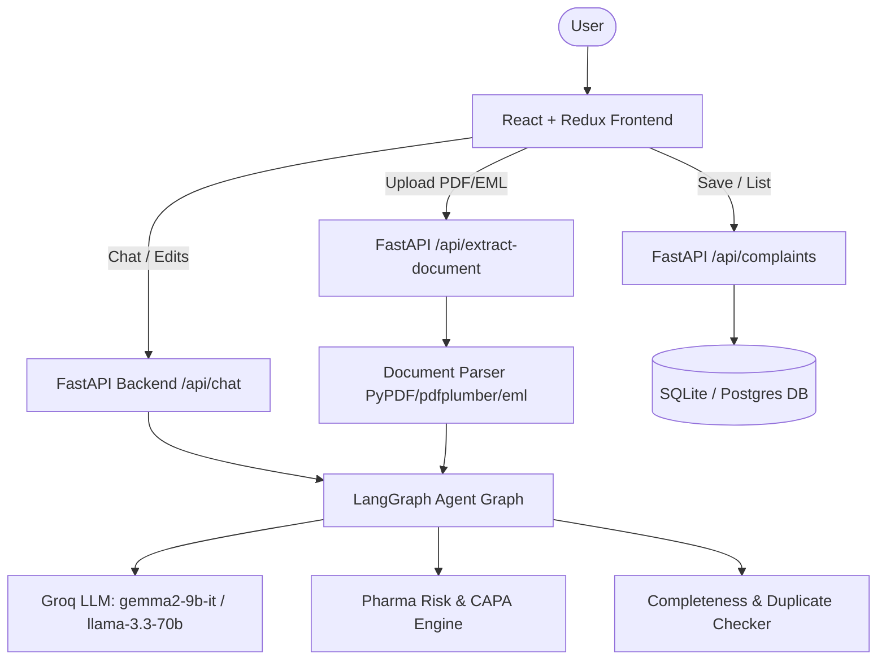

# Implementation Plan - AI-Powered Customer Complaint Management System (Pharma QMS)

Build a full-stack, production-ready **AI-Powered Customer Complaint Management System** for the pharmaceutical manufacturing industry (API & FDF QMS). The system faithfully replicates the reference UI design and implements the end-to-end workflow shown in the demo video and assignment document.

## User Review Required

> [!IMPORTANT]
> - **Groq API Key**: The backend will support the `GROQ_API_KEY` environment variable (specifically targeting `gemma2-9b-it` or `llama-3.3-70b-versatile`). A robust fallback mechanism with structured JSON extraction using an intelligent built-in fallback parser is also included so the application operates seamlessly even before an API key is configured.
> - **Database**: Uses SQLite (`qms_complaints.db`) by default for instant zero-configuration setup, with optional PostgreSQL URL support (`DATABASE_URL`).
> - **Sample Documents**: Includes pre-built sample complaint documents (`.pdf`, `.eml`, `.txt`) matching the exact demo video examples (e.g. Amoxicillin capsules 500mg, Metformin Hydrochloride API).

## Proposed Architecture

---

## Key Components to Implement

### 1. Backend (`/backend`)
- **Dependencies**: `fastapi`, `uvicorn`, `langgraph`, `langchain-groq`, `langchain-core`, `pydantic`, `sqlalchemy`, `pypdf`, `python-multipart`, `python-dotenv`.
- **Database Schema (`backend/database.py` & `backend/models.py`)**:
  - `Complaint` model: `id`, `complaint_number`, `complaint_source`, `customer_name`, `product_name`, `product_strength`, `batch_number`, `mfg_date`, `expiry_date`, `quantity_affected`, `complaint_type`, `complaint_date`, `description`, `initial_severity`, `priority`, `suggested_next_action`, `risk_reasoning`, `capa_recommendation`, `completeness_score`, `status`, `created_at`.
- **LangGraph Agent Workflow (`backend/agent/graph.py`)**:
  - **State**: `form_data`, `risk_assessment`, `completeness`, `duplicates`, `messages`, `intent`.
  - **Tool 1: Log Complaint Tool**: Natural language field extraction + Pharma Risk Assessment.
  - **Tool 2: Edit Complaint Tool**: Differential update to existing form data while preserving unchanged fields.
  - **Tool 3: Document Extraction Tool**: Text extraction from PDF/EML/TXT + structured entity extraction.
  - **Bonus Engines**:
    - **Completeness Checker**: Calculates % complete and lists missing critical QMS fields.
    - **Pharma Risk & CAPA Engine**: Evaluates severity (Critical, Major, Minor), risk priority level, and suggests actionable QA investigation steps & CAPA.
    - **Duplicate Complaint Detector**: Queries database for matching batch/lot numbers or product complaints.
- **API Routes (`backend/main.py`)**:
  - `POST /api/chat`: Process natural language prompts with LangGraph agent.
  - `POST /api/extract-document`: Handle PDF/DOCX/EML/TXT file uploads and return extracted complaint form state.
  - `GET /api/complaints`: List all saved complaints.
  - `POST /api/complaints`: Save logged complaint to database.
  - `GET /api/sample-docs`: Download/retrieve sample PDF & EML files for 1-click test uploads.

---

### 2. Frontend (`/frontend`)
- **Dependencies**: Vite, React, Redux Toolkit (`@reduxjs/toolkit`, `react-redux`), `lucide-react`, Google Inter font integration.
- **Redux Store (`frontend/src/store/index.js`)**:
  - `complaintSlice.js`: Form state, risk assessment state, completeness score, edit history, saved complaints list.
  - `chatSlice.js`: Messages stream, extraction progress, active tab (Upload vs Text), loading indicators.
- **UI Components**:
  - **`Header.jsx`**: Title ("Log Customer Complaint - API & FDF Quality Assurance Module"), Status Badge ("Pending Triage" / "In Review"), Top bar controls.
  - **`ComplaintForm.jsx`** (Matching reference UI `image1.png`):
    - *Section 1: Origin & Customer Details* (Complaint Source, Customer Name)
    - *Section 2: Product & Batch Identification* (Product Name, Product Strength/Grade, Batch/Lot Number, Manufacturing Date, Expiry Date, Quantity Affected)
    - *Section 3: Complaint Details* (Complaint Type, Complaint Date, Detailed Complaint Description)
    - *Section 4: Initial Assessment & Priority* (Initial Severity, Priority, Suggested Next Action, Risk Analysis, CAPA Recommendation, Completeness Indicator)
    - *Action Buttons*: `Reset Form`, `Save Complaint`, `View All Complaints`
  - **`AICopilotPanel.jsx`** (Matching reference UI `image1.png`):
    - Document Upload Drag & Drop zone (Supported formats: PDF, DOCX, TXT, EML)
    - Quick Sample Buttons ("Load Sample Amoxicillin Complaint PDF", "Load Sample Metformin Email")
    - Text Paste Modal/Tab
    - Live Progress Bar during extraction
    - AI Assistant Chat Feed (shows user inputs, agent tool responses, extraction summaries)
    - Chat Input with placeholder "Ask me anything about this complaint..."
  - **`ComplaintsModal.jsx`**: View saved complaints in QMS database.

---

### 3. Sample Documents & Artifacts (`/sample_documents`)
- `amoxicillin_discoloration_complaint.pdf`: Realistic PDF complaint from Apollo Pharmacy for 500mg Amoxicillin capsules.
- `metformin_api_impurity_email.eml`: Realistic EML email complaint for Metformin Hydrochloride API (Batch MFH260712A).

---

## Verification Plan

### Automated & API Tests
1. **Backend API Test (`pytest` / HTTP test)**:
   - Test `/api/chat` with log prompt (e.g. *"Apollo Pharmacy reported discolored capsules in Amoxicillin capsules 500 mg"*). Verify JSON returns filled fields and risk assessment.
   - Test `/api/chat` with edit prompt (e.g. *"Sorry, batch number is BMX24602 and affected quantity is 48 capsules"*). Verify target fields updated and remaining fields preserved.
   - Test `/api/extract-document` with sample PDF file upload. Verify extraction.
   - Test `/api/complaints` POST & GET endpoints for DB persistence.

### Manual UI Verification
1. Launch FastAPI backend (`uvicorn backend.main:app --port 8000`) and React frontend (`npm run dev`).
2. Verify split-screen UI layout and typography (Google Inter font, clear field placeholders).
3. Test **Log Complaint Tool**: Enter natural language prompt in chat -> confirm left form populates automatically.
4. Test **Edit Complaint Tool**: Enter correction prompt -> confirm specific fields update instantly.
5. Test **Document Extraction Tool**: Upload sample PDF/EML -> confirm extraction progress bar & auto-populated form.
6. Test **Save Complaint**: Click "Save Complaint" -> verify saved into database and visible in Saved Complaints modal.
